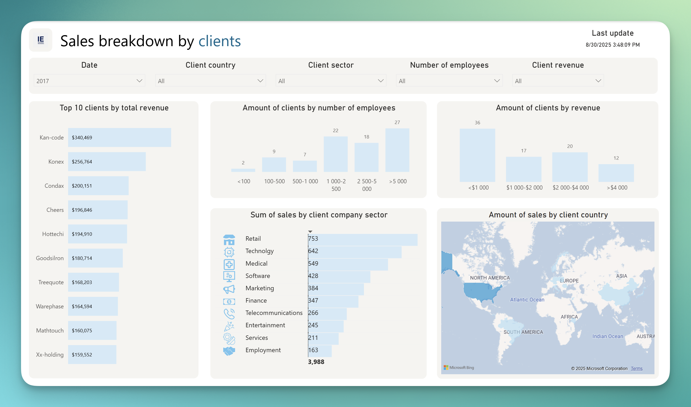
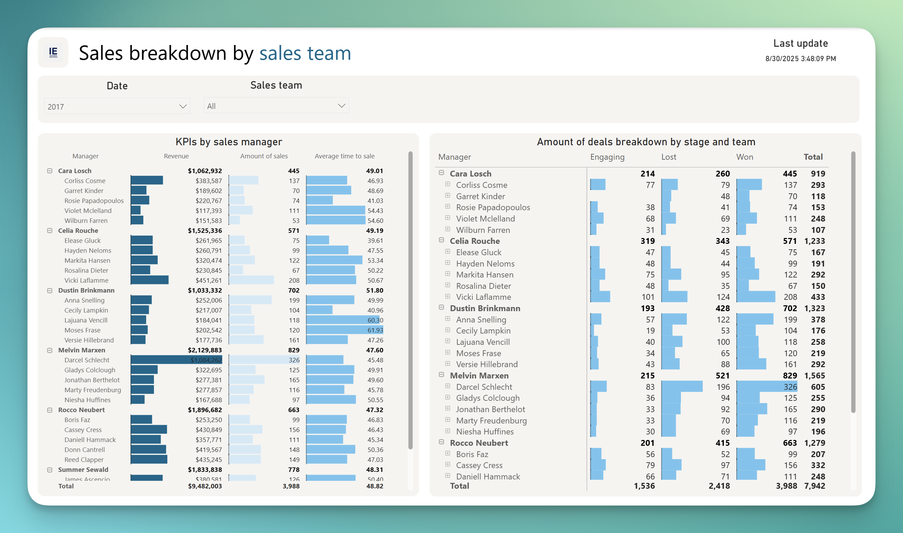

  

# Overview
A sales analysis dashboard for a company dataset from [Maven analytics challenge](https://mavenanalytics.io/challenges/maven-sales-challenge/8f59bcfa-d310-4947-b3d8-917b3cce270e). The focus is minimalism, simplicity and ease of use and understanding

Features:
- Hierachichal date selection
- KPIs comparison to previous selected period
- Plan completion tracking by manager and product tracking
- SVG icons showing client company sector
- Time to close a deals bar chart

    
    
    
    

# Report internal structure

  

Data modelled under star schema, tables are connected by primary keys id.

  

All measures are put in Measures table and provided descriptive names

# Running a report
You have two options:
- Download and open a file "Sales Dashboard.pbix" from Releases page.
- Clone a repo and open "Sales Dashboard.pbip" or "Sales Dashboard.Report/definition.pbir".

Provide a parameter "project_path" with a path to the downloaded report folder.